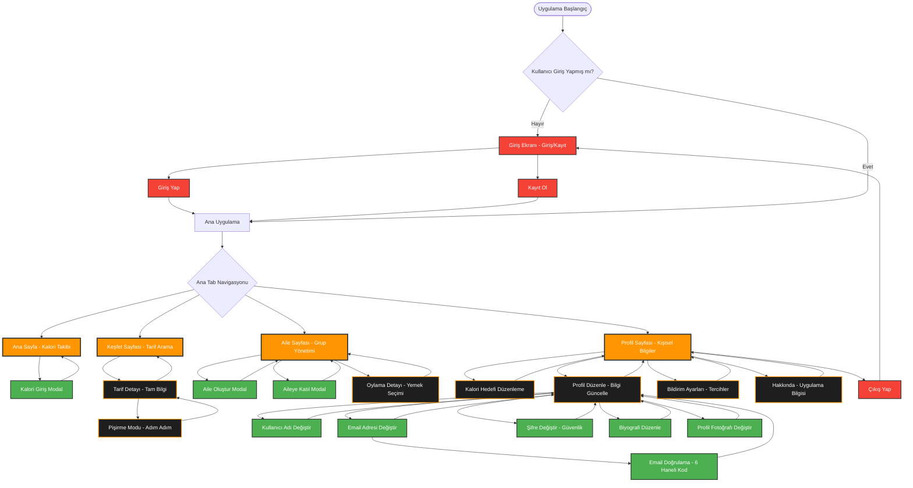

# 🗺️ **Yemek Koçu - Sayfa Akış Grafiği**



## 📋 **Sayfa Kategorileri ve Açıklamaları**

### **🔐 Kimlik Doğrulama (Authentication)**
- **Giriş Ekranı** - Kullanıcı giriş yapma ve kayıt olma sayfası
- **Giriş Yap** - Mevcut hesapla giriş işlemi
- **Kayıt Ol** - Yeni hesap oluşturma işlemi

### **📱 Ana Tab Sayfaları (4 Adet)**
- **🏠 Ana Sayfa** - Günlük kalori takibi ve genel özet
- **🔍 Keşfet Sayfası** - Tarif arama ve kategori filtreleme
- **👥 Aile Sayfası** - Aile üyeleri ve grup oylaması yönetimi
- **👤 Profil Sayfası** - Kişisel bilgiler ve uygulama ayarları

### **📖 Tarif İşlemleri Sayfaları**
- **📖 Tarif Detayı** - Malzemeler, talimatlar ve besin değerleri
- **👨‍🍳 Pişirme Modu** - Adım adım pişirme rehberi

### **👥 Aile Yönetimi Sayfaları**
- **🏠 Aile Oluştur Modal** - Yeni aile grubu kurma
- **👥 Aileye Katıl Modal** - Mevcut aile grubuna katılma
- **🗳️ Oylama Detayı** - Günlük yemek seçimi oylaması

### **👤 Profil Yönetimi Alt Sayfaları (4 Adet)**
- **📊 Kalori Hedefi Düzenleme** - Günlük kalori hedefini belirleme
- **✏️ Profil Düzenle** - Kişisel bilgileri güncelleme ana sayfası
- **🔔 Bildirim Ayarları** - Push notification tercihlerini ayarlama
- **ℹ️ Hakkında** - Uygulama versiyonu ve yasal bilgiler

### **✏️ Profil Düzenleme Detay Sayfaları (6 Adet)**
- **📝 Kullanıcı Adı Değiştir** - Username güncelleme (30 gün kısıtı)
- **📧 Email Adresi Değiştir** - Email güncelleme ve doğrulama
- **✅ Email Doğrulama** - 6 haneli doğrulama kodu girişi
- **🔒 Şifre Değiştir** - Mevcut şifre ile yeni şifre belirleme
- **📄 Biyografi Düzenle** - Kişisel açıklama metni güncelleme
- **📷 Profil Fotoğrafı Değiştir** - Avatar fotoğrafı yükleme

### **📊 Modal/Popup Sayfalar**
- **📊 Kalori Giriş Modal** - Günlük kalori kayıt formu
- **Onay Dialog'ları** - Çıkış, silme gibi kritik işlem onayları

## 🔄 **Temel Kullanıcı Akış Yolları**

### **🆕 İlk Defa Kullanan Kullanıcı**
```
Uygulama Başlangıç → Giriş Ekranı → Kayıt Ol → Ana Sayfa
```

### **🔄 Düzenli Kullanıcı**
```
Uygulama Başlangıç → Ana Sayfa (otomatik giriş)
```

### **🍳 Tarif Keşfi ve Pişirme**
```
Keşfet Sayfası → Tarif Detayı → Pişirme Modu → Tarif Detayı
```

### **👨‍👩‍👧‍👦 Aile Grup İşlemleri**
```
Aile Sayfası → Oylama Detayı (yemek seçimi)
Aile Sayfası → Aile Oluştur/Katıl (grup yönetimi)
```

### **⚙️ Profil ve Ayar Yönetimi**
```
Profil Sayfası → Profil Düzenle → Email Değiştir → Email Doğrulama
Profil Sayfası → Kalori Hedefi (günlük hedef belirleme)
Profil Sayfası → Bildirim Ayarları (tercih yönetimi)
```

## 📊 **Geliştirme Durumu İstatistikleri**

| **Kategori** | **Sayfa Sayısı** | **Durum** | **Açıklama** |
|--------------|------------------|-----------|--------------|
| **Ana Tab'lar** | 4 | ✅ **Tamamlandı** | HomeScreen, ExploreScreen, FamilyScreen, ProfileScreen |
| **Kimlik Doğrulama** | 3 | ✅ **Tamamlandı** | AuthScreen, Login, Register işlemleri |
| **Profil Alt Sayfaları** | 4 | 🚧 **Planlandı** | EditCalorie öncelikli |
| **Profil Düzenleme** | 6 | 🚧 **Planlandı** | Username, Email, Password vb. |
| **Tarif Sayfaları** | 2 | 📋 **Gelecek Sprint** | RecipeDetail, CookingMode |
| **Aile Sayfaları** | 3 | 🚧 **Kısmen Hazır** | VotingDetail eksik |
| **Modal/Popup** | 8+ | 🚧 **Planlandı** | Çeşitli onay ve form modal'ları |

## 🎯 **Geliştirme Öncelik Sıralaması**

### **🔥 Yüksek Öncelik (Bu Sprint)**
1. **📊 EditCalorieGoalScreen** - Kalori hedefi düzenleme (günlük kullanım)
2. **✏️ EditProfileScreen** - Profil düzenleme ana sayfası (temel ihtiyaç)
3. **📖 RecipeDetailScreen** - Tarif detayları (ana özellik)

### **⚡ Orta Öncelik (Sonraki Sprint)**
4. **📝 EditUsername** - Kullanıcı adı değiştirme (30 gün kısıtı)
5. **📧 EditEmail + EmailVerification** - Email değiştirme (güvenlik)
6. **🔔 NotificationSettingsScreen** - Bildirim ayarları (kullanıcı deneyimi)

### **📅 Düşük Öncelik (İleride)**
7. **👨‍🍳 CookingModeScreen** - Pişirme modu (premium özellik)
8. **🗳️ VotingDetailScreen** - Oylama detayları (aile özelliği)
9. **ℹ️ AboutScreen** - Uygulama hakkında (yasal gereklilik)

## 🎨 **Renk Kodları ve Tasarım**

- **🧡 Ana Tab'lar:** `#FF9500` (Turuncu - Ana renk)
- **⚫ Alt Sayfalar:** `#1E1E1E` (Koyu gri - İkincil)
- **🟢 Modal'lar:** `#4CAF50` (Yeşil - Etkileşim)
- **🔴 Kimlik Doğrulama:** `#F44336` (Kırmızı - Güvenlik)

---

**📅 Son Güncelleme:** 28 Haziran 2025  
**📊 Toplam Sayfa:** 25+ sayfa/modal  
**✅ Tamamlanan:** 7 sayfa  
**🚧 Kalan:** 18+ sayfa  
**🎯 Sıradaki:** EditCalorieGoalScreen 